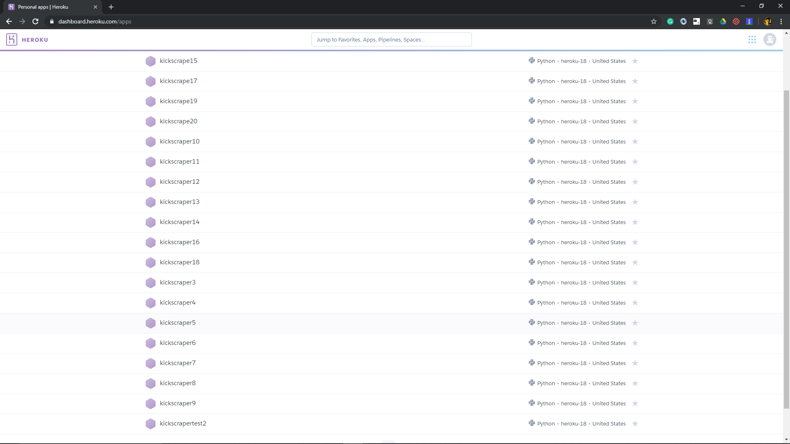
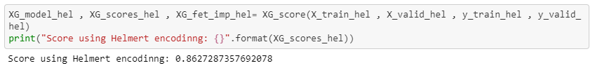
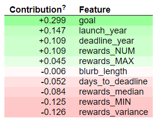
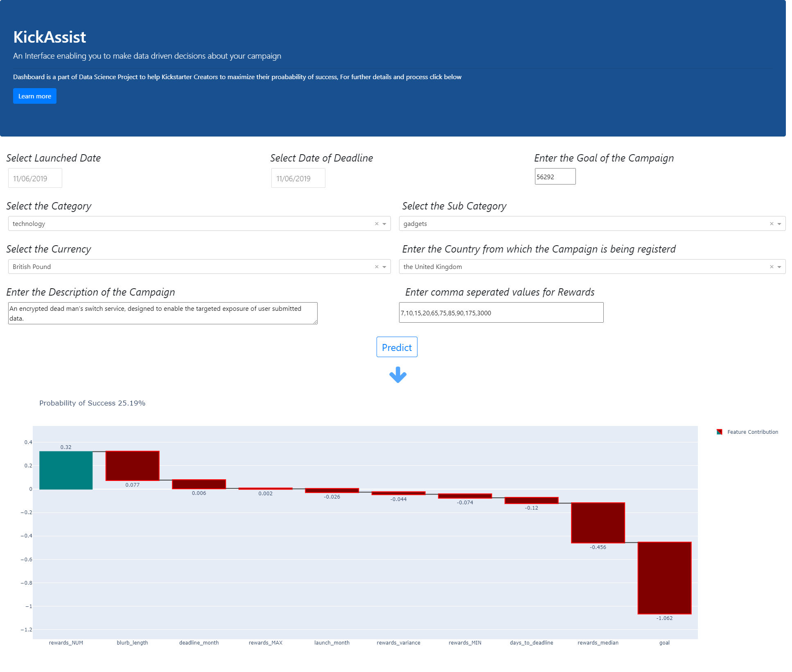

# **Contents**

1. **Introduction**

2. **Methodology and results**

3. **Limitations**

4. **Reproduce the results**


**Dashboard can be accessed be [Here](https://kick-assist.herokuapp.com/)**

## Introduction


## Context

KickStarter is a crowd funding platform for ideas and projects of diverse categories such as films, games, and music to art, design, and technology.

Individuals/Entrepreneurship with ideas or products start a campaign by creating a project on the platform explaining what the idea is about

- Creator must specify a date and goal(amount) when creating a project which are not flexile

- Creators are allowed to give rewards to Backers(AKA people who donated for the project) of the project based on the amount  these rewards can be anything depending on the project mostly it's the product itself which is being donated for(if it's a course then early access to a course or if it's some tech product them limited edition of the product etc.)

- If the project doe some reason is not able t reach the goal amount by the given date then the money collected up until that point is returned back to the backers and the project gets nothing( **all-or-nothing funding model**)

- So it is more like people bringing the project to life which makes it interesting


## Objective

As discussed above there are a few decisions which creator needs to make when starting the campaign, Which include the following 

- Deciding when to start the campaign(Launch Date)

- When to set the deadline

-  Goal Amount

- Deciding the right amount for the rewards

Since it is **all-or-nothing funding model** decisions we take with the above variables play a key role in deciding the success of the project 

**Therefore our objective is to Assist the creator of the campaign in deciding what would be the optimal values for the above 4 features which would maximize the probability of a successful campaign based on certain characteristics of the product**


## Domain Knowledge

Most the content I could find online can be summarized as follows

1. Having a well polished landing page with videos and images 

2. Interaction with donors(through comment section and others)

3. Marketing and networking as a whole

4. Well planned rewards 

5. Feasible duration for the given goal 

6. Delivering the rewards without delay 


## Data Sources

 A Web Crawler Platform named [Web Robots](https://webrobots.io/) has a few free data projects one of them happens to be kickstarter data, which is scrapped every month of the platform.

It provides a bunch of csv files with data loaded as dictionaries(JSON), Following are the features which can be extracted from the source

- Status(Success or failed)
- Category and Sub Category of the project
- lunch and deadline date
- Author and creator information
- Country of origin  and currency to be used for transaction

and a few other


## Framing ML Problem

Based on our objective and our data source, there are two kinds of features(variables) we have

- Which are related to our product itself and are fixed, can not be changed for the purpose of increasing the chances of success, variables like category, sub category etc. These variables can not be changed after we decide what our campaign is going to be because they are about the product of the campaign itself, For naming reasons lets call the fixed variables
- 
- One's which are to be decided sterically and which can(should) be altered  if doing so increases our probability of being successfully funded, this category includes rewards, goal, deadline , launch date etc., Let's call them flxeible variables

As the target feature(success or failed) is a categorical feature, it will be a classification problem

**Since our objective is not to make predictions about the campaign's success based on the features rather suggesting the optimal features for maximum chances for success, this slight variation in our problem statement demands our Model to be Interpretable**

**Requirement for Interpretability doesn't only effect our choice of ML model but it essentially drives our  Machine Learning Pipeline from preprocessing to model deployment, It mainly effects our feature engineering Process where in we are bound not to make any transformations(like dimensionality reduction) to our variables which can result in high accuracy at the expense of uninterpretable features transformations.**


Our model would be served for end use as a **interactive dashboard**, Where the creators can set adjust set both their fixed and flexible variables and visualize not only the probability of success but also, How has each of the flexible variables effected the probability this way he/she can adjust those variable's values to the closest plausible value to increase the chances for a successful campaign


A model with 80% accuracy(given balanced dataset) seems to be an acceptable as We will be using the model for interpretation not directly its predictions


<hr>

## Methodology and results

*All the code and a clear procedure is provided [here](https://github.com/sai-krishna-msk/KickAssist/tree/master/notebooks)*

1. Extracting the data from the source into a suitable form

2. Exploring the variables, dealing with null and unusual values

3. Performing basic preprocessing(Label Encoding, OneHot Encoding) and modeling 

4. As we identify Features present in our data source are in not suffice full fill our objective

   - As we identified in our domain knowledge that rewards is an important feature, there is no feature indicating any measure of rewards in the dataset

   - Crossing 80% does not seem possible without it

     

   So We scrape the data of about 2,00,000 projects from the website for the following features

   - Rewards

   - Number of Campaigns the Creator already had

   - Number of Campaigns the creator has already funded

   - When would the rewards be delivered

     

   as learnt in the domain knowledge section,  marketing and networking increases the chances of success since we do not have any direct way of extracting that information we use "number of campaigns creator has already launched" as a proxy indicator of this measure

   

   

   


5. Finally after collecting all the data required for our objective we go ahead with Exploratory Data Analysis(EDA), in which we discover some valuable insights and get to test statistical significance of our assumptions 


6. We Perform modeling at this stage as we discussed we can not perform feature transformation in a way that would make our model uninterpretable but as we clearly made a distinction between fixed variables and flexible variables above, we've seen that we do not need fix variables to be interpretable as they would be fixed and subjected to no change by the creator so we try our different feature encoding techniques on fixed variables, finally we get an accuracy of 86% using XGboost with helmert encoding of a subset of features

   

   


7. We use ELI5 packages which uses the feature importance of model to give what are the contribution of each feature for a prediction,





8. XGboost model and ELI5 model are used embedded in a Dash(plotly) application to develop a dashboard which shows an interactive waterfall plot where creators can modify  different features to see which feature needs to be altered for high probability of success, Dashboard can be viewed [here](https://kick-assist.herokuapp.com/) 




## Limitations

- We are not considering how good the product actually is

- We are not considering how good the description and the overall presentation of the project is(description , images and videos)

- We are not considering the experience of the person hosting the project (how many backed and how many pledged), Giving us insight into how can he market the product 

- We are not considering whether the product has been staff picked(as this happens after few days after the  kickstarter campaign has been launched)

- We are not considering the social media marketing it has gone through

- We are not considering the general need for the product 

- We are not considering whether the tech used in the product is currently in trending if yes then how much


<hr>


## Reproducing the results

*I will be walking through each of the sub repository's*

**Note**

**Data is not present in the repository as it exceeds the limit of 100mb for each file on Github, it can be downloaded [here](https://bit.ly/2XHwxAx) and placed in the outermost directory of the project(along with API, Dashboard etc.)**

**Before running any code install all required  packages present in requirements.txt**

```bash
pip install -r requirements.txt
```

### Notebook

It  contains all the code required to reproduce the process from data extraction to model interpretation divided into different notebooks in the order listed in the methodology section


## Scripts

- As already mentioned data source updates the data every month so to keep our model from getting stale we need to retrain it every month, which is not efficient to carry out in Jupiter notebooks as the pipeline and procedure is determined and is no more experimental

- This sub repo consists of code to carry out the entire procedure from downloading the source data(through scraping), scraping our key features directly and train our model ,further save it

**Note** If the project is intended to run in future then variables in config file have to be altered accordingly

**Scraping**

- As scraping our new features takes a lot of time, the code is written to run on heroku and files would be saved to dropboox.

- We would be having two types files saved in dropbox
  - CSV for dataset
  - Log.txt for viewing the rows which for some reason could not be scraped
- Before running DropBox api key has to updated in config file

Models and encoders are saved in estimators folder


### API

A simple Flask-API to serve the predictions and feature importance's for the corresponding prediction


### Dashboard

Contains code for Dash(plotly) dashboard which is the final product

Dashboard itself can be accessed  [here](https://kick-assist.herokuapp.com/)


 

